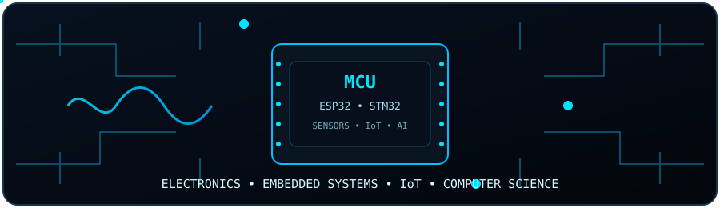

  

<h1 align="center">Hi 👋, I'm Ganamoorthy</h1>

  

  
  &nbsp;
  

  

## 👨‍💻 About Me

I'm a **BSc Honours in Electronics and Computer Science undergraduate at the University of Kelaniya, Sri Lanka**, interested in building practical engineering systems that combine **electronics, embedded systems, IoT, communication technologies, software, and intelligent data processing**.

My primary interest is in **electronics and embedded systems**, especially hardware-software integration and real-world engineering applications.

### 🔹 Areas I Work With

<table width="100%">
  <tr>
    <td width="50%" valign="top">
      <ul>
        <li>🔧 <b>Embedded Systems &amp; Electronics</b></li>
        <li>🌐 <b>IoT &amp; Connected Devices</b></li>
        <li>📡 <b>Sensor Systems</b></li>
        <li>🤖 <b>Robotics &amp; Intelligent Systems</b></li>
      </ul>
    </td>
    <td width="50%" valign="top">
      <ul>
        <li>🔋 <b>Battery Monitoring &amp; Power Systems</b></li>
        <li>🧠 <b>Machine Learning &amp; Sensor Data Processing</b></li>
        <li>💻 <b>Hardware &amp; Software Integration</b></li>
        <li>🔬 <b>Engineering Research &amp; Development</b></li>
      </ul>
    </td>
  </tr>
</table>

  

## ⚡ Tech Stack

### 💻 Programming

  

  
  
  
  
  

### 🔧 Embedded &amp; Electronics

  

  
  
  
  
  
  
  

  
  
  
  
  
  
  

### 🌐 Web, IoT &amp; Communication

  

  
  
  
  
  
  

### 🤖 AI &amp; Machine Learning

  

  
  
  
  

  
  
  
  

  

## 📊 Skill Areas

  

  

## 🔬 Final-Year Research

<table width="100%">
  <tr>
    <td>
      <h3>🎓 One-Year Undergraduate Research Project</h3>
      

        As part of my <b>BSc Honours in Electronics and Computer Science at the University of Kelaniya</b>, I am undertaking a <b>one-year final-year undergraduate research project</b>.
      

      

        The research focuses on applying <b>electronics, embedded systems, sensors, IoT, and intelligent technologies</b> to develop a practical engineering solution.
      

      
<b>Research Areas</b>

      

        <code>Embedded Systems</code> · <code>Electronics</code> · <code>Sensors</code> · <code>IoT</code> 
        <code>Machine Learning</code> · <code>Sensor Data Processing</code> · <code>Position Estimation</code> 
        <code>Engineering Research &amp; Development</code>
      

    </td>
  </tr>
</table>

  

## 📚 Currently Learning

  

  

## 🎓 Education & 🎯 Professional Interests

<table width="100%">
  <tr>
    <td width="48%" valign="top">
      <h3>🎓 Education</h3>
      

        <b>University of Kelaniya — Sri Lanka</b> 
        <b>BSc Honours in Electronics and Computer Science</b>
      

    </td>
    <td width="52%" valign="top">
      <h3>🎯 Professional Interests</h3>
      

        <b>Embedded Systems</b> · <b>Electronics Engineering</b> · <b>IoT</b> 
        <b>Robotics</b> · <b>Wireless Communication</b> · <b>GPS &amp; Navigation</b> 
        <b>Battery &amp; Power Monitoring</b> · <b>Machine Learning</b> · <b>Sensor Systems</b> 
        <b>Engineering Research</b>
      

    </td>
  </tr>
</table>

  

## 🌐 Connect With Me

  
  &nbsp;
  
  &nbsp;
  

  

  

